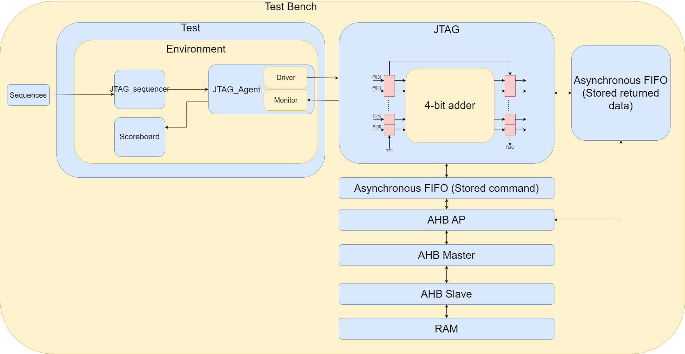

# JTAG SoCET

The following README contains our documentation for the JTAG project completed over Fall 23' and Spring 24'.

| Section | Description |
| ----------- | ----------- |
| FPGA | XXXX |
| Debugger | XXXX |
| AHB | XXXX |
| Makefile | XXXX |
| UVM | XXXX |

## FPGA

Our FPGA code contains the synthesizable JTAG module placed on a 4-bit adder, this allows us to test the boundary scan functionality by connecting the debugger to the FPGA via GPIO pins.

The code for compiling the JTAG module on the FPGA is contained within the ~/FPGA directory

This code can be compiled on the lab computers via an mg account (437) using the following command

**This should be adapted to work on the SoCET asicfab accounts as well in the future**

`synthesize -d jtag_fpga`

Here are the pin descriptions for the FPGA:

| Pin | Description |
| ----------- | ----------- |
| Switch 0-8 | Parallel In A, Parallel In B, Carry In |
| Hex Disp 0-1| Parallel In Out, Carry Out |
| Button 3 | TRST | 
| GPIO Pin # | TMS | 
| GPIO Pin # | TCK |
| GPIO Pin # | TDI |
| GPIO Pin # | TDO |

## Debugger

The following section refers to the code in ~/jtag_debugger_esp32

The debugger code is written in Arduino (C++)

Currently it is set up for the ESP32 with the following pin maps:

- Pin 12 - **TCK**
- Pin 27 - **TMS**
- Pin 14 - **TDI**
- Pin 15 - **TDO**

The clock speed is configurable through the **half_period** variable

Currently, the debugger code uses digitalWrite and digitalRead for testing simplicity in most of the functions, however, this can be changed to the following for speed (already done for **TCK**)

`digitalWrite(PIN#, 1)` with `GPIO.out_w1ts = ((uint32_t)1 << PIN#);` 

*w1ts = write 1 to set*

`digitalWrite(PIN#, 0)` with `GPIO.out_w1tc = ((uint32_t)1 << PIN#);`

*wt1c = write 1 to clear*

`digitalRead(PIN#)` with `(GPIO.in >> PIN#)`

The debugger directory also contains code for a parser that will improve the functionality of the code. This parser allows you to read through a BSDL (Boundary Scan Description Language File) and populate a text file with the constants that are used in the Arduino code. *The functionality that must be added to this is a command to run the parser and populate the constants in the Arduino code.*

## Parser

We designed a custom parser so it can read the standard BSDL files and populate the specific constants in a text file to make using our custom debugger more flexible.

Once in the `jtag_debugger_esp32` directory, run the following command to run the parser which should create `output.txt`

`python3 parse.py`

## Custom AHB instruction

We designed a 41-bit custom AHB instruction that allow for read and write to the RAM of device through AHB protocol.
- Data [32 bits]: The wdata writes to AHB if data mode select, the address of registers if address mode select.
- Regselect [1 bit]: select process mode of address or data, addr = 0, data = 1
- Size [2 bits]: size of transaction in bytes (word = 0, halfword = 1 or 2, byte = 3)
- Addr incremented [4 bits]: indicates the number of times the address need to be incremented
- Read or Write [1 bit]: read = 0, write = 1

### AHB Write
 1. send address instruction, include the address, the size, and amount of times need to be incremented 
 2. send the data
 
### AHB Read
send the address, size and the amount of times need to be incremented

## JTAG UVM TestBench
A brief description of how the JTAG UVM TestBench work.
### Top Level Diagram

### Progress
We have successfully finished the testing of EXTEST, PRELOAD/SAMPLE, and IDCODE instruction. You can see that there is three different sequence in sequence.sh. The instructions we haven't tested are AHB, AHB_READ, and BYPASS.
### Interface signals for UVM TestBench
In UVM testbench, we use jtag_if.vh interface signals to allow driver and monitor of UVM to communicate with each other. The driver controls those signals, and the monitor reads the signals. Below is the description of those signals. Besides the handshake signals, there is an output signal from the serial-to-parallel shift register called sr_parllel_out.
#### capture_check (For Boundary Scan Register Test)    
	When the driver finishes the process of capturing and updating the data, the driver insert this signals to 1.
#### scan_check (For Boundary Scan Register Test)
	When the driver finishes the process of scanning-in and updating the data, the driver insert this signals to 1.
#### id_check (For ID Register Test)    
	When the driver finishes the process of scanning-out the idcode, the driver insert this signals to 1.
#### sr_parallel_out (Output of serial-to-parallel shift register)
	It is used to store the series of TDO.
### Transaction Fields
Here is the brief description of the fields of Transaction.Instruction, parallel_in, and tap series are generated by sequence.vh. Capture_system_logic_out, scan_system_logic_out, sr_parallel_out, and id_code are updated by monitor and predictor and are sent to comparator to compare the actual output and expected output.
#### instruction    
	It is the instruction we want to test.
#### parallel_in    
	It is the parallel input of the core logic which the boundary scan registers attach to. In our case, the parallel input is for 4-bit adder.
#### tap_series   
	It is the serial input we want to scan into the boudary scan register.
#### capture_system_logic_out    
	This field is to record the parallel output of the core logic(adder) after the capture of the parallel input and the update of boudary scan register.
#### scan_system_logic_out    
	This field is to record the parallel output of the core logic(adder) after the scan-in of the tap_series and the update of boudary scan register.
#### sr_parallel_out    
	This field is to record the series of TDO after shifting out of the data on the regsiter. Currently, this field is used for the test of boundary scan register. In future, this signal can be used for recording the data reading back from AHB.
#### id_code
	This field is to record the id code after shifting out the id code on the id register.

### Makefile Command for UVM Testbench
There are three makefile command for UVM testbench. We use Questasim to compile the code and do the simulation.
#### make uvm_build
	This command is used for compiling the JTAG source code and UVM testbench.
#### make uvm_run
	This command is used for compiling and simulating the JTAG source code and UVM testbench without GUI.
#### make uvm_run_gui
	This command is used for compiling and simulating the JTAG source code and UVM testbench with GUI.
